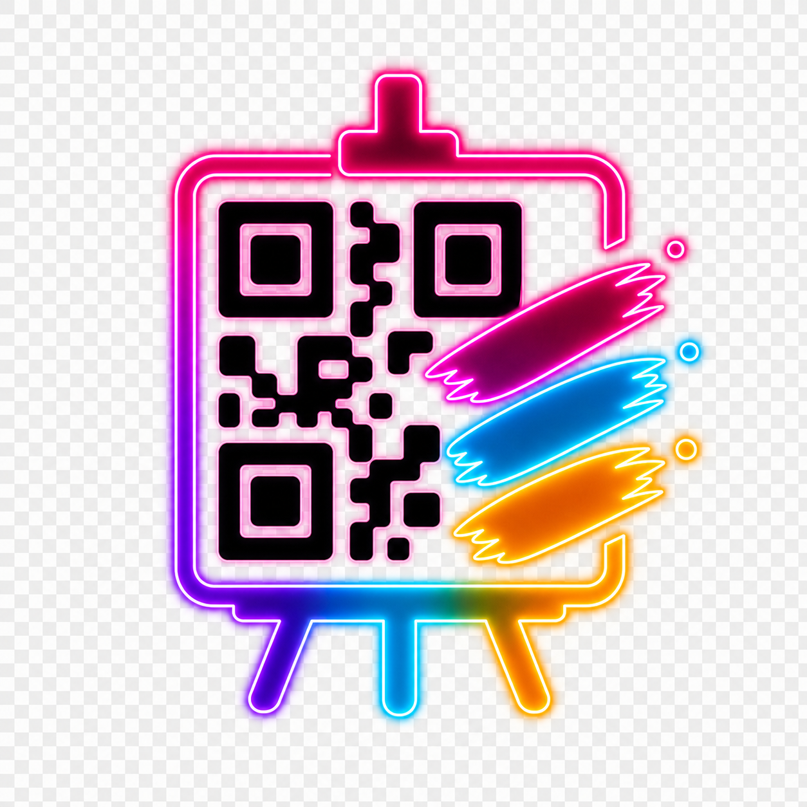
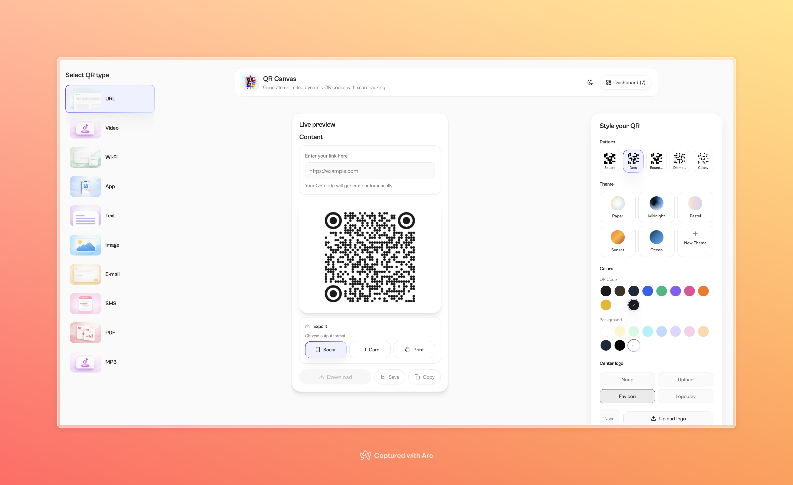
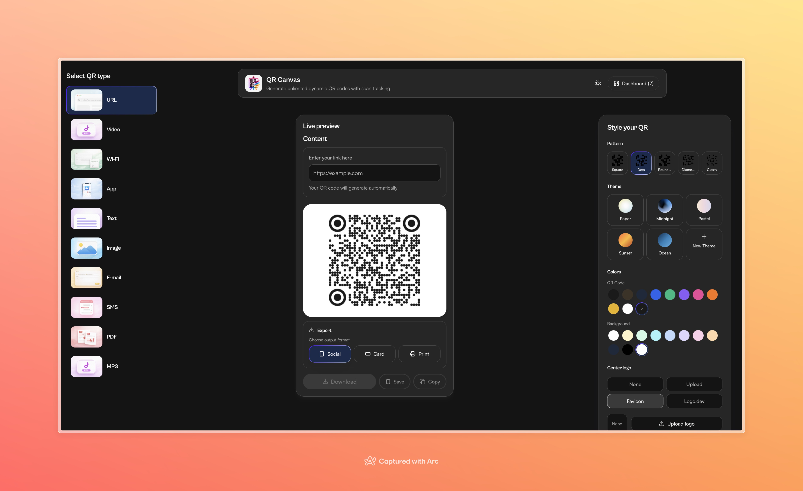
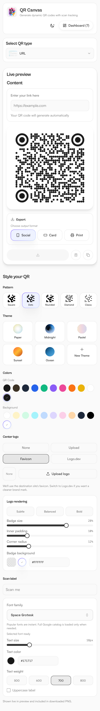
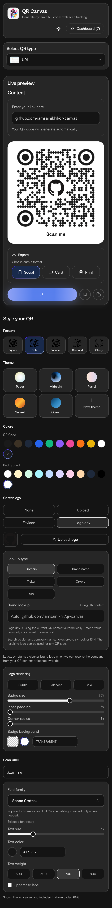
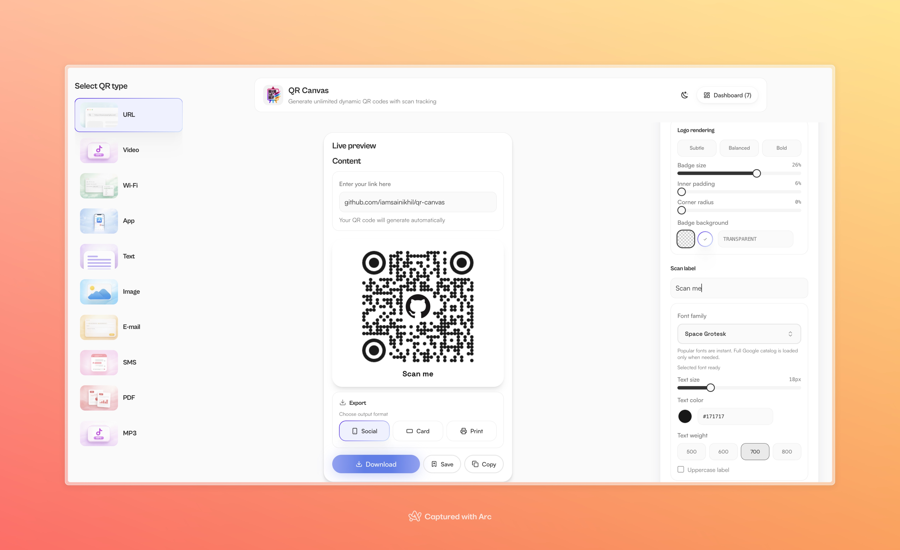
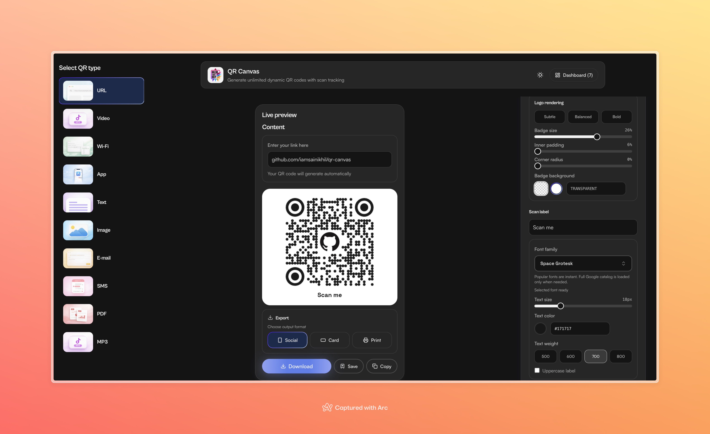
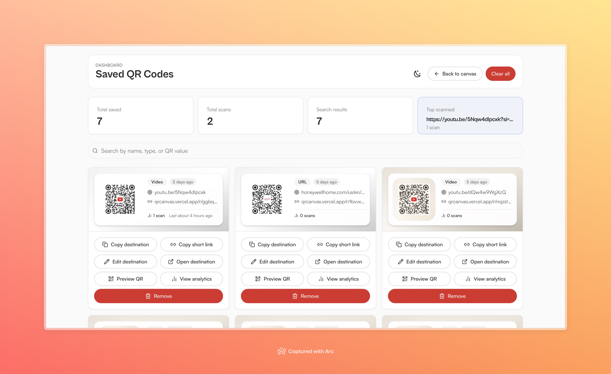
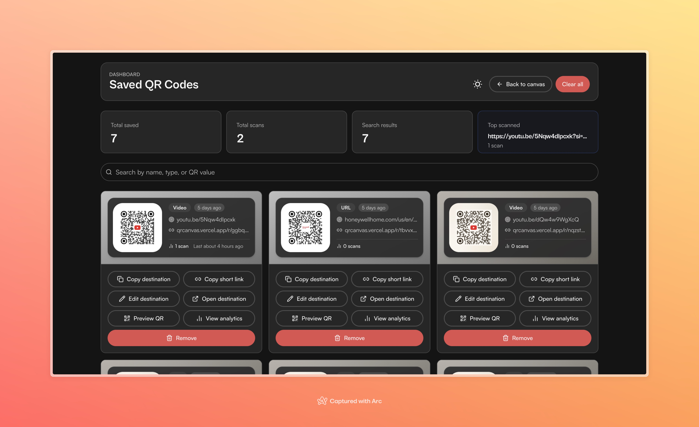
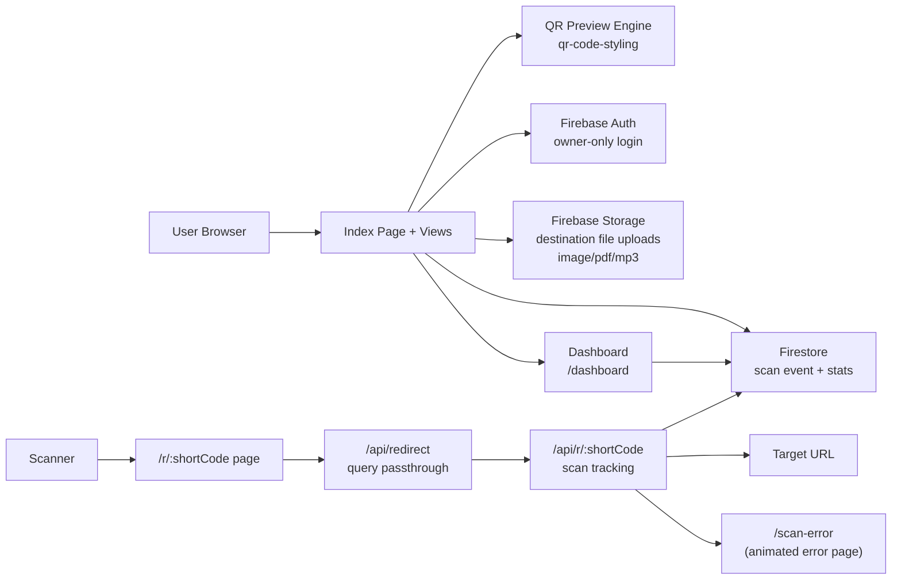

<p align="center">
  
</p>

<h1 align="center">QR Canvas</h1>

<p align="center">
  <strong>Free, open-source, self-hosted dynamic QR code generator with scan analytics</strong>
</p>

<p align="center">
  <a href="LICENSE"></a>
  
</p>

<details>
<summary><strong>Table of Contents</strong></summary>

- [Features](#features)
  - [Dynamic QR Codes](#dynamic-qr-codes--edit-destinations-after-printing)
  - [Scan Analytics & Visitor Tracking](#scan-analytics--visitor-tracking)
  - [Unlimited Saves](#unlimited-saves)
  - [Self-Hosted](#self-hosted)
  - [Rich Visual Customization](#rich-visual-customization)
  - [Free for Personal & Commercial Use](#free-for-personal--commercial-use)
- [Demos](#demos)
- [Screenshots](#screenshots)
- [Architecture](#architecture)
  - [Data Flow](#data-flow)
  - [Project Structure](#project-structure)
- [Getting Started](#getting-started)
  - [Prerequisites](#prerequisites)
  - [Quick Start](#quick-start)
  - [Full Setup (Firebase + Tracking)](#full-setup-firebase--tracking)
- [Environment Variables](#environment-variables)
  - [Frontend](#frontend-envlocal)
  - [Serverless (Vercel)](#serverless-vercel)
- [Private Deployment](#private-deployment-owner-only-access)
- [Firebase Security Rules](#firebase-security-rules)
  - [Firestore](#firestore)
  - [Firebase Storage](#firebase-storage)
- [Scan Tracking Pipeline](#scan-tracking-pipeline)
- [NPM Scripts](#npm-scripts)
- [Troubleshooting](#troubleshooting)
- [Performance Considerations](#performance-considerations)
- [Development Notes](#development-notes)

</details>

---

Most QR code services charge a premium for dynamic codes, scan analytics, and unlimited saves — often $20–$100/month for features that should be free.

QR Canvas gives you **everything** for free: unlimited dynamic QR codes, full scan analytics with geo/UTM tracking, the ability to **change a QR code's destination after it's already been printed**, and a self-hosted architecture that keeps your data on your own infrastructure.

No tiers. No paywalls. No limits.

---

## Features

### Dynamic QR Codes — Edit Destinations After Printing

Once you save a QR code to your dashboard, you can **change its destination at any time** — the printed QR code keeps working because the short URL (`/r/:shortCode`) stays the same, only the redirect target updates. This works for URL, video, app, image, PDF, and MP3 QR types.

Trackable types get a short redirect URL; non-trackable types (text, Wi-Fi, email, SMS) are saved directly.

### Scan Analytics & Visitor Tracking

Every dynamic QR code comes with full analytics:

- **Total scans & unique visitors** — know how many people scanned and how many are repeat visitors
- **Scans over time** — 7-day and 30-day charts to spot trends
- **Geographic insights** — country, region, and city per scan (when available)
- **Referrer tracking** — see where scanners are coming from
- **UTM parameter capture** — campaign, source, medium, term, and content
- **CSV export** — download raw scan data for your own analysis
- **Bot filtering** — crawlers and social media previewers do not inflate scan counts
- **Visitor cookie** — persistent visitor ID tracks unique vs. returning scanners

### Unlimited Saves

Save as many QR codes as you need. No caps, no storage quotas, no upgrade prompts.

### Self-Hosted

Deploy on your own infrastructure — Vercel, Railway, or any Node.js host. Your data stays on your Firebase/Firestore under your control. Full single-owner security rules included.

### Rich Visual Customization

- **10 QR types** — URL, Video, App, Text, Wi-Fi, Email, SMS, Image, PDF, MP3
- **Colors & gradients** — foreground, background, pattern colors, and background gradients
- **Body shapes** — square, dots, rounded, diamond, classy
- **Frame styles** — square, rounded (sm/md/lg), rounded-left, rounded-right, pill (horizontal/vertical), circle
- **Theme presets** — built-in themes plus custom saved themes
- **Logo support** — manual upload, auto-favicon for URLs, logo.dev integration with badge controls (size, padding, corner radius, background)
- **Logo rendering presets** — subtle, balanced, bold
- **Scan labels** — custom text with 700+ Google Fonts (on-demand catalog), weight (500–800), size, color, and uppercase toggle
- **Live preview** — instant visual feedback as you tweak styles
- **Download size control** — adjustable export resolution

### Free for Personal & Commercial Use

Licensed under GPL v3. Use it for your business, your side project, your client work — no license fees, no attribution required.

---

## Demos

> These demos show the v0 version of the app. Check [Screenshots](#screenshots) for the current v2 version which has significant UI and feature improvements.

| | |
|---|---|
| **QR Code Generator & Dashboard** | **QR Types Overview** |
| <video src="https://github.com/user-attachments/assets/55c8da83-7779-4bbc-8c74-5e85b37926cc" controls width="100%"></video> | <video src="https://github.com/user-attachments/assets/ffe4afe3-d6e2-4ee3-8e9c-60f2b49ba52e" controls width="100%"></video> |
| **App Responsiveness** | **File Upload QR Codes (Image, PDF, MP3)** |
| <video src="https://github.com/user-attachments/assets/fd49c85d-c47c-480b-b3bc-4ae11fc41467" controls width="100%"></video> | <video src="https://github.com/user-attachments/assets/4f1c56dd-4bf8-4cfb-bb39-38480b98cf26" controls width="100%"></video> |

---

## Screenshots

### App Overview

| Light | Dark |
|-------|------|
|  |  |

Full workspace with QR type selection, live preview, and styling controls in one view.

### Control Panel

| Light | Dark |
|-------|------|
|  |  |

Theme, pattern, color, logo, and scan label controls.

### Branded Output

| Light | Dark |
|-------|------|
|  |  |

Final output with logo from logo.dev (or you can upload your own logo) and scan label.

### Dashboard & Analytics

| Light | Dark |
|-------|------|
|  |  |

Personal QR library with unlimited per-code scan tracking and analytics.

### QR Code Deletion — Full Cleanup

When deleting a QR code, the app now automatically cleans up all associated data:

- **Scan records** — all scan events for that QR are batch-deleted from Firestore
- **Uploaded assets** — if the QR targets an uploaded file (image, PDF, MP3), the file is removed from Firebase Storage
- **Route mapping** — the short-code redirect document is deleted from Firestore

This ensures no orphaned data remains in your project.

---

## Architecture

```
Frontend:    Next.js + TypeScript + Tailwind CSS + shadcn/ui
QR Library:   qr-code-styling
Auth:        Firebase Auth (Google, owner-only mode)
Database:    Firestore (QR library, scan events, route mappings)
Storage:     Firebase Storage (uploaded destination files for image/pdf/mp3 QR types)
Redirect:    Next.js API Routes (/api/redirect, /api/r/[shortCode])
Icons:       Iconify
Charts:      Custom SVG bar charts (no charting library dependency)
```

### Data Flow



### Project Structure

```
app/
├── layout.tsx                        # Root layout + global CSS
├── page.tsx                          # Home page (wraps Index view in PrivateAppGate)
├── not-found.tsx                     # 404 page
├── error.tsx                         # Route error boundary
├── global-error.tsx                  # Global error boundary
├── globals.css                       # Imports src/index.css
├── dashboard/page.tsx                # Dashboard page (wraps Dashboard view)
├── scan-error/page.tsx               # Scan redirect error page
├── r/[shortCode]/page.tsx            # Redirect entry: proxies to /api/redirect
├── api/
│   ├── redirect/route.ts             # Query passthrough to /api/r/:shortCode
│   └── r/[shortCode]/route.ts        # Scan tracking + Firestore log + redirect
src/
├── views/
│   ├── Index.tsx                     # Main QR builder & state orchestration
│   ├── Dashboard.tsx                 # Saved QR library, analytics, edit destination
│   └── Error.tsx                     # Animated error page (Lottie) with reason presets
├── components/
│   ├── QRTypeSelector.tsx            # QR type picker (desktop sidebar + mobile select)
│   ├── QRStyleTabs.tsx               # Content + style controls (URL, WiFi, Email, SMS, upload)
│   ├── QRPreview.tsx                 # Live QR render & download
│   ├── ThemePresets.tsx              # Built-in & custom themes
│   ├── PrivateAppGate.tsx            # Owner-only Google auth gate + sign-in flow
│   ├── BodyShapeSelector.tsx         # Pattern shape picker (square, dots, rounded, diamond, classy)
│   ├── ColorPicker.tsx               # Color swatches + inline color picker
│   ├── SizeSelector.tsx              # Download resolution control
│   ├── SizeSlider.tsx                # Slider wrapper for size
│   ├── RuntimeRecovery.tsx           # Auto-recovery on chunk load failures
│   ├── logoStyle.ts                  # Logo style options type + defaults
│   ├── scanLabelStyle.ts             # Scan label style options type + defaults
│   └── ui/                           # shadcn/ui primitives
├── lib/
│   ├── firestoreQrCodes.ts           # Firestore CRUD + scan events + update destination + cleanup
│   ├── savedQrCodes.ts               # Type definitions, short code gen, tracking URL builder
│   ├── authOwner.ts                  # Current owner UID helper
│   ├── firebaseAdmin.ts              # Firebase Admin SDK init (for server-side redirect)
│   ├── fontRegistry.ts               # Google Fonts on-demand loading + catalog
│   └── utils.ts                      # Shared utilities (cn, color helpers, image src)
├── integrations/
│   └── firebase/
│       └── client.ts                 # Firebase init (Auth, Firestore, Storage, Analytics)
├── hooks/
│   ├── use-toast.ts                  # Toast notification hook
│   ├── use-theme.ts                  # Light/dark theme toggle + localStorage
│   ├── use-google-font.ts            # Font load status hook
│   └── use-mobile.tsx                # Mobile breakpoint detection
├── assets/                           # QR-type icons (webp), pattern SVGs, theme images
├── styles/                           # Global styles
├── index.css                         # Tailwind directives + base styles
└── test/                             # Test setup
firestore.rules                       # Firestore security rules (single-owner)
storage.rules                         # Firebase Storage rules (destination file uploads)
```

---

## Getting Started

### Prerequisites

- Node.js 20+
- npm 10+
- Git
- Firebase project with Auth + Firestore enabled

### Quick Start

```bash
git clone <your-repo-url>
cd qr-canvas
npm install
npm run dev
```

Open http://localhost:8080. The UI works immediately; saving, tracking, and analytics require Firebase setup.

### Full Setup (Firebase + Tracking)

See [Firebase Console Setup](#firebase-console-setup) to configure Auth, Firestore, and the redirect endpoint.

---

## Environment Variables

### Frontend (`.env.local`)

| Variable | Required | Description |
|----------|----------|-------------|
| `NEXT_PUBLIC_FIREBASE_API_KEY` | Yes | Firebase project API key |
| `NEXT_PUBLIC_FIREBASE_AUTH_DOMAIN` | Yes | Firebase auth domain |
| `NEXT_PUBLIC_FIREBASE_PROJECT_ID` | Yes | Firebase project ID |
| `NEXT_PUBLIC_FIREBASE_STORAGE_BUCKET` | Yes | Firebase storage bucket |
| `NEXT_PUBLIC_FIREBASE_MESSAGING_SENDER_ID` | Yes | Firebase sender ID |
| `NEXT_PUBLIC_FIREBASE_APP_ID` | Yes | Firebase app ID |
| `NEXT_PUBLIC_FIREBASE_MEASUREMENT_ID` | No | Firebase analytics measurement ID |
| `NEXT_PUBLIC_PRIVATE_MODE` | No | `true` to enforce owner-only login |
| `NEXT_PUBLIC_LOGO_DEV_PUBLISHABLE_KEY` | No | Enables logo.dev auto-lookup |
| `OWNER_EMAIL` | If private | Server-only email of the single allowed user |

### Serverless (Vercel)

| Variable | Description |
|----------|-------------|
| `FIREBASE_PROJECT_ID` | Firebase project ID |
| `FIREBASE_CLIENT_EMAIL` | Service account client email |
| `FIREBASE_PRIVATE_KEY` | Service account private key |
| `SCAN_IP_HASH_SALT` | Salt for IP hashing |

---

## Private Deployment (Owner-Only Access)

To lock the app so only you can use it:

1. Enable Google sign-in in Firebase Auth and add your Vercel domain.
2. Set `NEXT_PUBLIC_PRIVATE_MODE=true` and `OWNER_EMAIL` in Vercel.
3. (Optional) Enable Vercel Password Protection for an extra lock.

With this enabled, the app verifies sign-in tokens on the server and only allows the Google user matching `OWNER_EMAIL`. The first allowed sign-in creates an `app_config/private` Firestore document that permanently locks the project to that Firebase Auth UID.

---

## Firebase Security Rules

### Firestore

The repo includes strict [single-owner rules](firestore.rules) covering:

- `app_config/private` — bootstrap owner config
- `users/{uid}/qrs/{qrId}` — owner-only QR documents
- `users/{uid}/qrs/{qrId}/scans/{scanId}` — owner read, Admin SDK create/update, owner delete (enables scan cleanup on QR deletion)
- `qr_routes/{shortCode}` — owner-only route mappings

Deploy via Firebase CLI:

```bash
firebase deploy --only firestore:rules
```

Or paste `firestore.rules` directly in the Firebase Console.

### Firebase Storage

The repo includes [Storage rules](storage.rules) for QR destination file uploads:

- `users/{uid}/qr-targets/{qrType}/{fileName}` — publicly readable, owner-only write
- All other paths denied by default

Deploy via Firebase CLI:

```bash
firebase deploy --only storage:rules
```

Or paste `storage.rules` directly in the Firebase Console.

---

## Scan Tracking Pipeline

1. **Save** a trackable QR code (URL, video, app, image, PDF, MP3) — a short URL (`/r/:shortCode`) and route mapping are created.
2. **Scanner** opens the short URL.
3. **`/r/:shortCode`** (Next.js page) proxies to **`/api/redirect`** with query params.
4. **`/api/redirect`** forwards to **`/api/r/:shortCode`**, preserving UTM params.
5. **`/api/r/:shortCode`** (serverless function) logs the scan to Firestore (bot UA strings are filtered out), then redirects to the current destination.
6. **Change the destination anytime** — edit it in the dashboard, the short URL stays the same, and all printed QR codes instantly point to the new target.

Captured scan data: timestamp, visitor cookie ID (persistent 1-year), user agent, referrer, country/region/city (from Vercel headers), hashed IP prefix, and UTM parameters.

---

## NPM Scripts

| Script | Description |
|--------|-------------|
| `npm run dev` | Local Next.js dev server |
| `npm run build` | Production build |
| `npm run start` | Start Next.js production server |
| `npm run lint` | Run ESLint |

---

## Troubleshooting

| Problem | Solution |
|---------|----------|
| Env changes not picked up | Restart `npm run dev` |
| Port conflict | Run `npm run dev -- --port 3005` |
| Firebase Auth redirect loop | Add your domain to Firebase Auth → Authorized domains |
| Permission denied | Deploy `firestore.rules` and verify `NEXT_PUBLIC_FIREBASE_PROJECT_ID` |
| Scan redirects fail (in dev) | Use `npm run dev` |
| Scan redirects fail (prod) | Check `FIREBASE_PRIVATE_KEY` has preserved newlines; deploy with Vercel |
| Chunk load error in production | The built-in `RuntimeRecovery` component auto-refreshes the page once on chunk load failures |

---

## Performance Considerations

- **Dashboard pagination** — saved QRs are limited to the 300 most recent via Firestore query; consider pagination for heavy usage
- **Firestore costs** — each save, delete, or scan writes to Firestore; monitor your free-tier usage
- **Batch deletion** — scan records are deleted in batches of 400 to stay within Firestore limits; large numbers of scans may take multiple round-trips
- **Font loading** — scan label fonts load on demand; a curated set of 30 popular fonts is shown immediately, with the full 700+ Google Font catalog fetched only when the font picker is opened
- **Logo loading** — logos from external sources (logo.dev, favicons) load async; CORS-protected logos gracefully degrade without breaking the QR render

---

## Development Notes

- **UI-only development**: Use `npm run dev` for rapid component iteration
- **Testing redirects**: Use `vercel dev` to emulate the Vercel serverless environment
- **Firebase required** for save, tracking, and analytics features
- **Vercel deployment** is optional but recommended for testing redirects
- This project follows a local-first workflow — no cloud dependency for UI development
