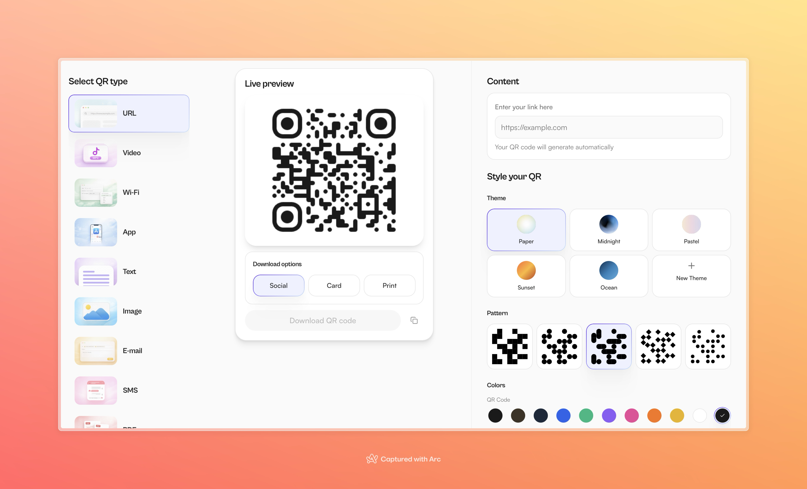
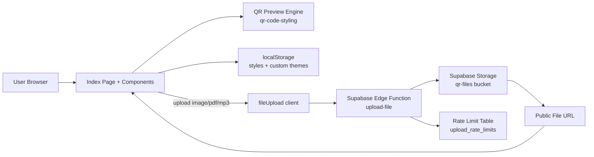
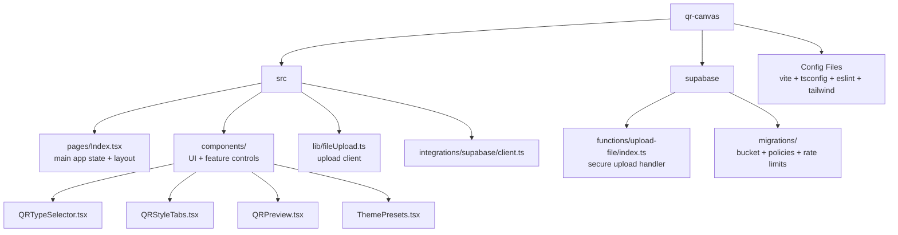

# QR Canvas

QR Canvas is a React + TypeScript app for generating stylish, downloadable QR codes with rich visual customization.

This repository is optimized for local development and personal/self-hosted use.

## Screenshots

### 1) App Overview



Full workspace view with QR type selection, live preview, and styling controls visible at once.

### 2) Control Panel Details


Closer view of theme, pattern, color, logo, and scan label controls.

### 3) Branded Output Example


Example final output with custom logo and scan label applied.

## Highlights

- Generate QR codes for:
	- URL
	- Video link
	- App link
	- Plain text
	- Wi-Fi credentials
	- Email compose links
	- SMS compose links
	- Image/PDF/MP3 file links (optional upload backend)
- Visual customization:
	- Foreground/background colors
	- Optional background gradients
	- Pattern color controls
	- Body shape styles (square, dots, rounded, classy, sharp)
	- Frame styles (square, rounded variants, pills, circle)
	- Theme presets plus custom saved themes
- Logo support:
	- Manual upload
	- Auto-favicon for URL/app/email inputs
	- Optional logo.dev integration
	- Badge sizing, padding, corner radius, and background controls
- Scan label support:
	- Custom text below QR
	- 700+ Google Fonts (loaded on demand) with family, weight, size, and transform controls
- Export and utility:
	- Adjustable output size
	- Copy QR value to clipboard
	- Download rendered QR output

## Architecture

- Frontend: React 18, TypeScript, Vite
- Styling/UI: Tailwind CSS + shadcn/ui + Radix primitives
- Routing: react-router-dom
- Data utilities: @tanstack/react-query (UI infra)
- QR rendering: qr-code-styling
- Optional backend for uploads:
	- Supabase Storage bucket
	- Supabase Edge Function for secure file upload flow

### Architecture Diagram



## Project Structure

- src/pages/Index.tsx: Main QR builder screen and state orchestration
- src/components/QRTypeSelector.tsx: QR type selector
- src/components/QRStyleTabs.tsx: Content + style controls
- src/components/QRPreview.tsx: Live QR render and download pipeline
- src/components/ThemePresets.tsx: Built-in and custom theme handling
- src/lib/fileUpload.ts: Browser upload client for upload-backed QR types
- supabase/functions/upload-file/index.ts: Edge Function upload endpoint
- supabase/migrations/: Storage, policies, and rate-limit table migrations

### Repository Map



## Requirements

Minimum:

- Node.js 20+
- npm 10+
- Git

Optional for upload-backed QR types:

- Docker Desktop
- Supabase CLI

## Installation

```bash
git clone <your-repo-url>
cd qr-canvas
npm install
```

## Run Locally

### Mode A: Core App (No Backend)

Use this for pure local QR generation without file uploads.

```bash
npm run dev
```

Open http://localhost:8080.

Works in this mode:

- URL, Video, App, Text, Wi-Fi, Email, SMS QR types
- All visual styling, themes, logo controls, and downloads

Not available in this mode:

- Image/PDF/MP3 upload-to-link flow

### Mode B: Full App (Local Supabase + Uploads)

Use this mode if you want image/PDF/MP3 upload QR types.

1. Start local Supabase:

```bash
supabase start
```

2. Apply migrations:

```bash
supabase db reset
```

3. Read local credentials:

```bash
supabase status
```

4. Create root env file `.env.local`:

```bash
VITE_SUPABASE_URL=http://127.0.0.1:54321
VITE_SUPABASE_PUBLISHABLE_KEY=<local_anon_key>

# optional
VITE_LOGO_DEV_PUBLISHABLE_KEY=<logo_dev_publishable_key>
```

5. Create function env file `supabase/functions/.env.local`:

```bash
SUPABASE_URL=http://127.0.0.1:54321
SUPABASE_SERVICE_ROLE_KEY=<local_service_role_key>
```

6. Run the upload function in a second terminal:

```bash
supabase functions serve upload-file --env-file supabase/functions/.env.local
```

7. Start frontend:

```bash
npm run dev
```

## Environment Variables

Frontend:

- VITE_SUPABASE_URL
	- Required only for upload-backed QR types
- VITE_SUPABASE_PUBLISHABLE_KEY
	- Required only for upload-backed QR types
- VITE_LOGO_DEV_PUBLISHABLE_KEY
	- Optional; enables logo.dev lookup mode

Edge Function (local runtime):

- SUPABASE_URL
- SUPABASE_SERVICE_ROLE_KEY

## NPM Scripts

```bash
npm run dev         # local dev server (port 8080)
npm run build       # production build
npm run build:dev   # development-mode build
npm run preview     # preview dist build
npm run lint        # eslint
npm run test        # run vitest once
npm run test:watch  # vitest watch mode
```

## Upload Security Model

The upload flow is implemented with server-side checks in the Edge Function:

- Allowed MIME type enforcement
- Magic-byte file signature validation
- File size limit (10 MB)
- Extension/type consistency checks
- IP-based rate limiting
- Service-role upload to storage bucket

Important:

- Never expose SUPABASE_SERVICE_ROLE_KEY in frontend code.
- Keep local env files out of version control.

## Troubleshooting

1. Upload returns 401/403 or network error
- Confirm `supabase start` is active.
- Confirm upload function is running.
- Confirm `.env.local` values are correct.

2. Storage bucket or policy errors
- Run `supabase db reset` to re-apply migrations.

3. Env var changes are ignored
- Restart `npm run dev` after editing env files.

4. Port 8080 conflict
- Stop the conflicting process or update Vite port.

## Performance Note

Production build may show large chunk warnings due to bundled assets and font data. This does not block local usage. If needed, you can later optimize with route/code splitting and manual chunking.

## Development Notes

- This project intentionally supports a local-first workflow.
- Deployment is optional and not required to use the app effectively.
