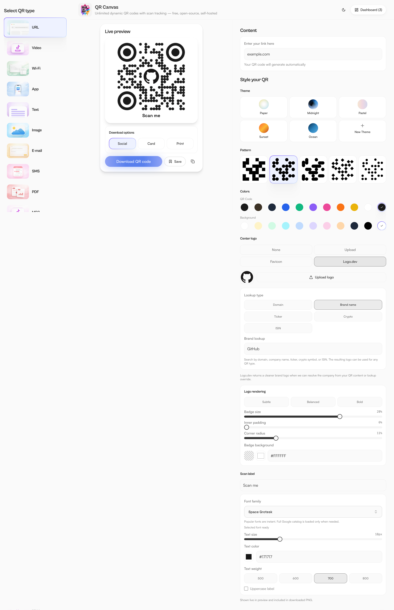
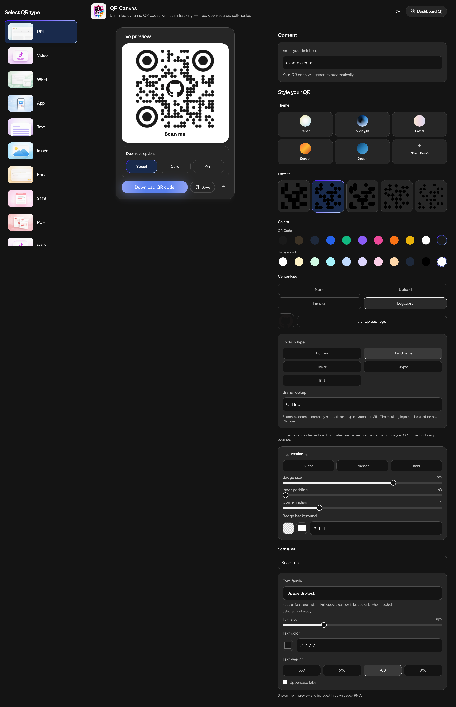
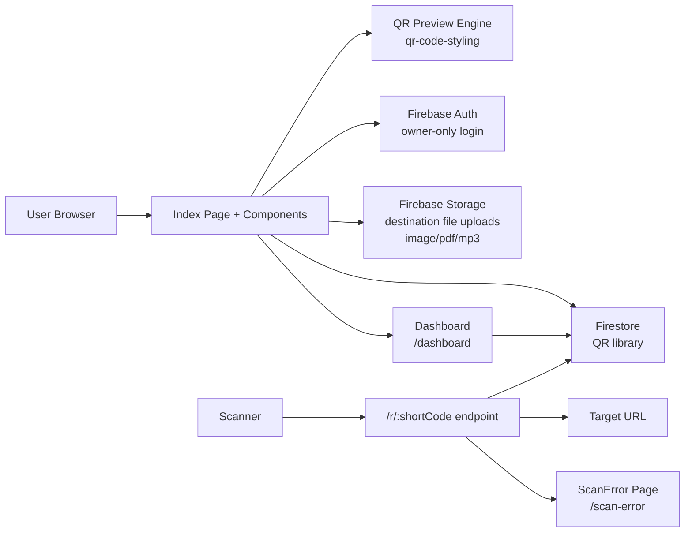

<p align="center">
  
</p>

<h1 align="center">QR Canvas</h1>

<p align="center">
  <strong>Free, open-source, self-hosted dynamic QR code generator with scan analytics</strong>
</p>

<p align="center">
  <a href="LICENSE"></a>
  
</p>

---

Most QR code services charge a premium for dynamic codes, scan analytics, and unlimited saves — often $20–$100/month for features that should be free.

QR Canvas gives you **everything** for free: unlimited dynamic QR codes, full scan analytics with geo/UTM tracking, the ability to **change a QR code's destination after it's already been printed**, and a self-hosted architecture that keeps your data on your own infrastructure.

No tiers. No paywalls. No limits.

---

## Features

### Dynamic QR Codes — Edit Destinations After Printing

Once you save a QR code to your dashboard, you can **change its destination at any time** — the printed QR code keeps working because the short URL (`/r/:shortCode`) stays the same, only the redirect target updates. This works for URL, video, app, image, PDF, and MP3 QR codes.

### Scan Analytics & Visitor Tracking

Every dynamic QR code comes with full analytics:

- **Total scans & unique visitors** — know how many people scanned and how many are repeat visitors
- **Scans over time** — 7-day and 30-day charts to spot trends
- **Geographic insights** — country, region, and city per scan (when available)
- **Referrer tracking** — see where scanners are coming from
- **UTM parameter capture** — campaign, source, medium, term, and content
- **CSV export** — download raw scan data for your own analysis

### Unlimited Saves

Save as many QR codes as you need. No caps, no storage quotas, no upgrade prompts.

### Self-Hosted

Deploy on your own infrastructure — Vercel, Railway, or any Node.js host. Your data stays on your Firebase/Firestore under your control. Full single-owner security rules included.

### Rich Visual Customization

- **10 QR types** — URL, Video, App, Text, Wi-Fi, Email, SMS, Image, PDF, MP3
- **Colors & gradients** — foreground, background, pattern colors, and background gradients
- **Body shapes** — square, dots, rounded, classy, sharp
- **Frame styles** — square, rounded variants, pills, circle
- **Theme presets** — built-in themes plus custom saved themes
- **Logo support** — manual upload, auto-favicon for URLs, logo.dev integration with badge controls
- **Scan labels** — custom text with 700+ Google Fonts, weight, size, and transform controls

### Free for Personal & Commercial Use

Licensed under GPL v3. Use it for your business, your side project, your client work — no license fees, no attribution required.

---

## Demos

| | |
|---|---|
| **QR Code Generator & Dashboard** | **QR Types Overview** |
| <video src="https://github.com/user-attachments/assets/55c8da83-7779-4bbc-8c74-5e85b37926cc" controls width="100%"></video> | <video src="https://github.com/user-attachments/assets/ffe4afe3-d6e2-4ee3-8e9c-60f2b49ba52e" controls width="100%"></video> |
| **App Responsiveness** | **File Upload QR Codes (Image, PDF, MP3)** |
| <video src="https://github.com/user-attachments/assets/fd49c85d-c47c-480b-b3bc-4ae11fc41467" controls width="100%"></video> | <video src="https://github.com/user-attachments/assets/4f1c56dd-4bf8-4cfb-bb39-38480b98cf26" controls width="100%"></video> |

---

## Screenshots

### App Overview

| Light | Dark |
|-------|------|
|  |  |

Full workspace with QR type selection, live preview, and styling controls in one view.

### Control Panel

| Light | Dark |
|-------|------|
|  |  |

Theme, pattern, color, logo, and scan label controls.

### Branded Output

| Light | Dark |
|-------|------|
|  |  |

Final output with logo from logo.dev (or you can upload your own logo) and scan label.

### Dashboard & Analytics

| Light | Dark |
|-------|------|
|  |  |

Personal QR library with unlimited per-code scan tracking and analytics.

### QR Code Deletion — Full Cleanup

When deleting a QR code, the app now automatically cleans up all associated data:

- **Scan records** — all scan events for that QR are batch-deleted from Firestore
- **Uploaded assets** — if the QR targets an uploaded file (image, PDF, MP3), the file is removed from Firebase Storage
- **Route mapping** — the short-code redirect document is deleted from Firestore

This ensures no orphaned data remains in your project.

---

## Architecture

```
Frontend:    React 18 + TypeScript + Vite + Tailwind CSS + shadcn/ui
QR Engine:   qr-code-styling
Auth:        Firebase Auth (Google, owner-only mode)
Database:    Firestore (QR library, scan events, route mappings)
Storage:     Firebase Storage (uploaded destination files for image/pdf/mp3 QR types)
Redirect:    Vercel Serverless Function (/api/r/[shortCode].ts)
Analytics:   Firebase Analytics (page views) + custom scan tracking
```

### Data Flow



### Project Structure

```
src/
├── pages/
│   ├── Index.tsx          # Main QR builder & state orchestration
│   ├── Dashboard.tsx      # Saved QR library, analytics, edit destination
│   ├── ScanError.tsx      # Animated error page for failed redirects
│   └── NotFound.tsx       # 404 page
├── components/
│   ├── QRTypeSelector.tsx # QR type picker
│   ├── QRStyleTabs.tsx    # Content + style controls (incl. file upload UI for image/pdf/mp3)
│   ├── QRPreview.tsx      # Live QR render & download
│   ├── ThemePresets.tsx   # Built-in & custom themes
│   ├── PrivateAppGate.tsx # Owner-only Google auth gate
│   ├── QRControls.tsx     # QR control panel layout
│   ├── QRScanner.tsx      # Scan QR from webcam
│   └── ui/                # shadcn/ui primitives
├── lib/
│   ├── firestoreQrCodes.ts # Firestore CRUD + scan events + update destination + bulk scan/storage cleanup
│   ├── savedQrCodes.ts     # Type definitions
│   ├── authOwner.ts        # Owner UID helper
│   ├── fontRegistry.ts     # Google Fonts loading
│   └── utils.ts            # Shared utilities
├── integrations/
│   └── firebase/
│       └── client.ts       # Firebase init (Auth, Firestore, Storage, Analytics)
├── hooks/
│   └── use-toast.ts        # Toast notification hook
├── assets/                 # QR-type icons (webp)
├── styles/                 # Global styles
└── test/                   # Test setup
api/
├── r/[shortCode].ts       # Scan tracking redirect endpoint
└── _lib/                   # API shared utilities
storage.rules              # Firebase Storage rules (destination file uploads)
```

---

## Getting Started

### Prerequisites

- Node.js 20+
- npm 10+
- Git
- Firebase project with Auth + Firestore enabled

### Quick Start

```bash
git clone <your-repo-url>
cd qr-canvas
npm install
npm run dev
```

Open http://localhost:8080. The UI works immediately; saving, tracking, and analytics require Firebase setup.

### Full Setup (Firebase + Tracking)

See [Firebase Console Setup](#firebase-console-setup) to configure Auth, Firestore, and the Vercel serverless redirect endpoint.

---

## Environment Variables

### Frontend (`.env.local`)

| Variable | Required | Description |
|----------|----------|-------------|
| `VITE_FIREBASE_API_KEY` | Yes | Firebase project API key |
| `VITE_FIREBASE_AUTH_DOMAIN` | Yes | Firebase auth domain |
| `VITE_FIREBASE_PROJECT_ID` | Yes | Firebase project ID |
| `VITE_FIREBASE_STORAGE_BUCKET` | Yes | Firebase storage bucket |
| `VITE_FIREBASE_MESSAGING_SENDER_ID` | Yes | Firebase sender ID |
| `VITE_FIREBASE_APP_ID` | Yes | Firebase app ID |
| `VITE_PRIVATE_MODE` | No | `true` to enforce owner-only login |
| `VITE_OWNER_EMAIL` | If private | Email of the single allowed user |
| `VITE_LOGO_DEV_PUBLISHABLE_KEY` | No | Enables logo.dev auto-lookup |

### Serverless (Vercel)

| Variable | Description |
|----------|-------------|
| `FIREBASE_PROJECT_ID` | Firebase project ID |
| `FIREBASE_CLIENT_EMAIL` | Service account client email |
| `FIREBASE_PRIVATE_KEY` | Service account private key |
| `SCAN_IP_HASH_SALT` | Salt for IP hashing |

---

## Private Deployment (Owner-Only Access)

To lock the app so only you can use it:

1. Enable Google sign-in in Firebase Auth and add your Vercel domain.
2. Set `VITE_PRIVATE_MODE=true` and `VITE_OWNER_EMAIL` in Vercel.
3. (Optional) Enable Vercel Password Protection for an extra lock.

With this enabled, only the Google user matching `VITE_OWNER_EMAIL` can sign in and access the app.

---

## Firebase Security Rules

### Firestore

The repo includes strict [single-owner rules](firestore.rules) covering:

- `app_config/private` — bootstrap owner config
- `users/{uid}/qrs/{qrId}` — owner-only QR documents
- `users/{uid}/qrs/{qrId}/scans/{scanId}` — owner read, Admin SDK create/update, owner delete (enables scan cleanup on QR deletion)
- `qr_routes/{shortCode}` — owner-only route mappings

Deploy via Firebase CLI:

```bash
firebase deploy --only firestore:rules
```

Or paste `firestore.rules` directly in the Firebase Console.

### Firebase Storage

The repo includes [Storage rules](storage.rules) for QR destination file uploads:

- `users/{uid}/qr-targets/{qrType}/{fileName}` — publicly readable, owner-only write
- All other paths denied by default

Deploy via Firebase CLI:

```bash
firebase deploy --only storage:rules
```

Or paste `storage.rules` directly in the Firebase Console.

---

## Scan Tracking Pipeline

1. Save a QR code in the dashboard — trackable types get a short URL (`/r/:shortCode`).
2. Scanners open the short URL.
3. The Vercel serverless function logs metadata to Firestore and redirects to the current destination.
4. **Change the destination anytime** — edit it in the dashboard, the short URL stays the same, and all printed QR codes instantly point to the new target.

Captured scan data: timestamp, visitor cookie ID, user agent, referrer, country/region/city, hashed IP prefix, and UTM parameters.

---

## NPM Scripts

| Script | Description |
|--------|-------------|
| `npm run dev` | Local dev server (port 8080) |
| `npm run build` | Production build |
| `npm run build:dev` | Dev-mode build |
| `npm run preview` | Preview production build |
| `npm run lint` | Run ESLint |
| `npm run test` | Run Vitest once |
| `npm run test:watch` | Vitest watch mode |

---

## Troubleshooting

| Problem | Solution |
|---------|----------|
| Env changes not picked up | Restart `npm run dev` and `vercel dev` |
| Port 8080 conflict | Update port in `vite.config.ts` |
| Firebase Auth redirect loop | Add your domain to Firebase Auth → Authorized domains |
| Permission denied | Deploy `firestore.rules` and verify `VITE_FIREBASE_PROJECT_ID` |
| Scan redirects fail (in dev) | Use `vercel dev` instead of `npm run dev` |
| Scan redirects fail (prod) | Check `FIREBASE_PRIVATE_KEY` has preserved newlines |

---

## Performance Considerations

- **Dashboard pagination** — if you save 100+ QRs, consider paginating the dashboard
- **Firestore costs** — each save, delete, or scan writes to Firestore; monitor your free-tier usage
- **Batch deletion** — scan records are deleted in batches of 400 to stay within Firestore limits; large numbers of scans may take multiple round-trips
- **Font loading** — scan label fonts load on demand, keeping the initial bundle lean

---

## Development Notes

- **UI-only development**: Use `npm run dev` for rapid component iteration
- **Testing redirects**: Use `vercel dev` to emulate the Vercel serverless environment
- **`vercel.json` `devCommand` scope**: `devCommand` is used by the Vercel CLI during local `vercel dev` sessions; it is not a production runtime process
- **Production behavior**: Vercel runs `installCommand` and `buildCommand` at build/deploy time, then serves static assets + serverless functions (no long-running `npm run dev` in prod)
- **Firebase required** for save, tracking, and analytics features
- **Vercel deployment** is optional but recommended for testing redirects
- This project follows a local-first workflow — no cloud dependency for UI development
